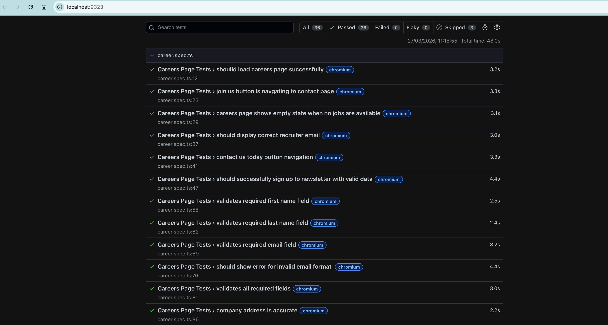

# Playwright Test Automation – Careers Page (Artrya)

## Overview

This project contains automated tests for the **Careers page** of the Artrya website using Playwright.

The test suite focuses on validating the **core functionalities and user experience** of the careers page, including:

- Page load and UI elements
- Empty job listings state
- Navigation flows
- Newsletter signup and validations
- Key content verification (email, address, etc.)

---

## Test Design Approach

- Implemented using **Playwright with TypeScript**
- Followed **Page Object Model (POM)** for better structure, reusability, and maintainability
- Tests are grouped logically using `test.describe`
- Focused on **real-world user scenarios and critical paths**

### Scope Considerations

- This automation is intentionally focused on the **Careers page only**
- Shared components like **header navigation menus and footer links** were not deeply tested, as they are common across the application and typically covered in separate test suites
- Only minimal validation (visibility/navigation) is considered sufficient for these shared elements

---

## ⚠️ Special Note

- A test case for **job listings validation** has been included but is currently marked as `skip`:

  This is because the careers page currently displays an **empty state ("No results found")** and does not have active job listings.

- The test is intentionally retained to demonstrate **future-ready test coverage**, ensuring that job listings can be validated once data becomes available.

---

## 🚀 Setup & Installation

### 1. Clone the repository

```bash
git clone <your-repo-url>
cd <your-project-folder>
```

### 2. Install dependencies

```bash
npm install
```

### 3. Install Playwright browsers

```bash
npx playwright install
```

---

## ▶️ Running Tests

### Run all tests

```bash
npx playwright test
```

### Run tests in headed mode

```bash
npx playwright test --headed
```

### Run a specific test file

```bash
npx playwright test tests/careers.spec.ts
```

---

## Test Coverage Highlights

- Careers page load validation
- Empty state validation (“No results found”)
- Navigation (Join Us / Contact Us)
- Newsletter signup (positive & negative scenarios)
- Content validation (recruiter email, company address)

## Test Report



---

## Notes

- Base URL configuration was not abstracted into a separate base file since the scope is limited to a single page

---

## Tech Stack

- Playwright
- TypeScript

---
